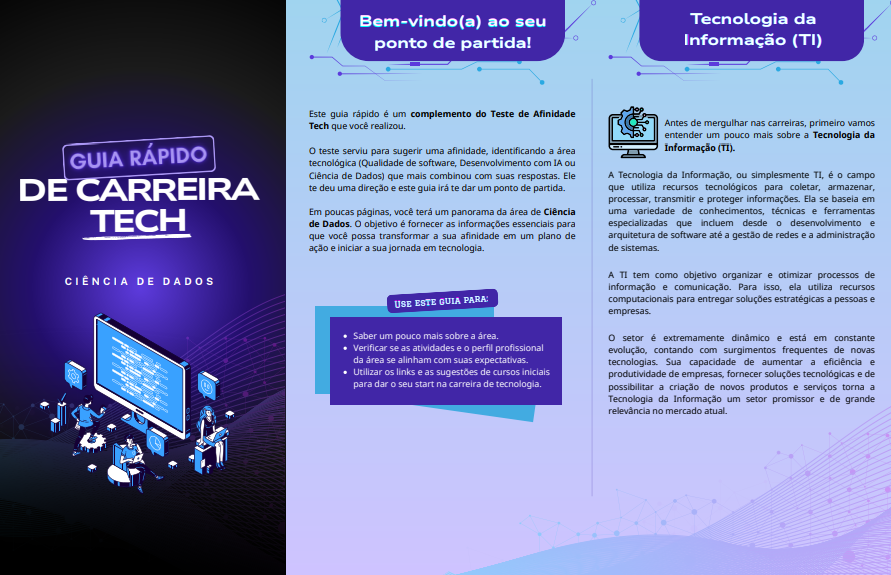

## Automação: Google Forms e Gemini

Este repositório contém um script em Google Apps Script desenvolvido para **automatizar a análise de formulários** de orientação de carreira, integrando o Google Forms diretamente com a API do Google Gemini.

O sistema processa as respostas, utiliza IA para classificar o perfil do usuário (Qualidade de Software, Ciência de Dados ou Desenvolvimento com IA) e **dispara e-mails com feedbacks personalizados e materiais de estudo** que incluem uma Cartilha em PDF com a trilha de estudos completa para a sua área de afinidade.

## Funcionalidades:

- **Gatilho Automático:** Execução em tempo real (`onFormSubmit`) a cada nova resposta no formulário.
- **Classificação Inteligente:** Algoritmo que identifica a área de afinidade baseada na frequência das alternativas (A, B, C) em 15 perguntas.
- **Análise com Gemini 2.5 Flash:** A IA personaliza o feedback analisando a resposta do usuário a uma pergunta aberta estratégica sobre conhecimentos prévios na área de tecnologia. Com isso, o sistema gera um comentário técnico e motivacional levando em conta:
  - O nome do participante.
  - O nível e as ferramentas que ele já domina (ex: conectando um conhecimento prévio em SQL com a trilha de Ciência de Dados).
- **E-mail HTML:** Envio de mensagem formatada via GmailApp.
- **Anexos Dinâmicos:** O script busca automaticamente no Google Drive o PDF correspondente à classificação (ex: `Ciência de dados.pdf`) e o anexa ao e-mail.

## Tecnologias:
- Linguagem: JavaScript (Google Apps Script)
- IA: Google Gemini API (REST via `UrlFetchApp`)
- Google Services: DriveApp, MailApp, SpreadsheetApp, PropertiesService.  

## Instalação e Configuração:

**1. Preparação**
- Tenha uma planilha vinculada ao seu Google Form.
- Crie uma pasta no Google Drive e coloque os PDFs das carreiras.
- Obtenha sua chave de API no [Google AI Studio](https://aistudio.google.com/).

**2. Configurando o Script**
  - Copie o conteúdo do arquivo automacao.js deste repositório para o seu projeto no Apps Script e faça os ajustes necessários.

**3. Segurança (API Key)**
- Nunca cole sua chave de API diretamente no código.
- No editor do Apps Script, vá em Configurações do Projeto (ícone de engrenagem ⚙️).
- Role até Propriedades do script.
- Clique em Adicionar propriedade de script:
- Propriedade: GEMINI_API_KEY
- Valor: Sua_Chave_Aqui...

**4. Ativando o Gatilho**
- Para que o script rode sozinho:
	- No menu lateral esquerdo, vá em Acionadores (ícone de relógio).
	- Clique em + Adicionar Acionador.

- Configure:
  - Função: onFormSubmitTrigger
  - Origem do evento: Da planilha
  - Tipo de evento: No envio do formulário

## Como funciona o Prompt:

O script captura e organiza dois tipos de dados do formulário e os envia para o Gemini com instruções estritas:
- **15 Perguntas Objetivas:** Usadas para contar as alternativas (A, B ou C) e definir a classificação vencedora.
- **1 Pergunta Discursiva:** A resposta à pergunta "Você já possui conhecimento em alguma tecnologia ou ferramenta específica..." é processada para criar o comentário personalizado, ajustando as dicas de estudo ao nível técnico do aluno.
O prompt final exige que a IA faça essa união de dados e retorne apenas um JSON estruturado, permitindo que o código em Apps Script processe as variáveis e monte o corpo do e-mail HTML.

## Demonstração

**1. O Formulário**  
- O teste capta o perfil através de 15 perguntas de múltipla escolha e entende o nível técnico atual do estudante pela pergunta discursiva.

  <table border="0">
    <tr>
      <td valign="top" width="40%">
        
         
      </td>
      <td width="5%">&nbsp;</td>
      <td valign="top" width="40%">
        
         
      </td>
    </tr>
  </table>

**2. O Resultado (E-mail recebido)**  
A IA adapta o tom e as dicas do e-mail de acordo com o nível técnico do aluno. Veja dois exemplos diferentes gerados pelo sistema:

  <table border="0">
    <tr>
      <td valign="top" width="40%">
        
         
      </td>
      <td width="5%">&nbsp;</td>
      <td valign="top" width="40%">
        
         
      </td>
    </tr>
  </table>

**3. Material de Apoio (Cartilhas)**  
Cada área recebe um material rico e exclusivo em PDF com a trilha completa de estudos:

  

**🔗 [Acesse aqui a pasta do Google Drive com todas as cartilhas completas](https://drive.google.com/drive/folders/14Ngwi-EM2Dn2Ws2yuE2CcLxzmaANkb5P)**

## Autores:

Este projeto foi desenvolvido em grupo para a disciplina de Empregabilidade e Carreira - Extensão do curso de Análise e Desenvolvimento de Sistemas (ADS) no SENAC.

  - Eliakim Oliveira
  - Lara Peddinghausen 
  - Nilo Lisboa

